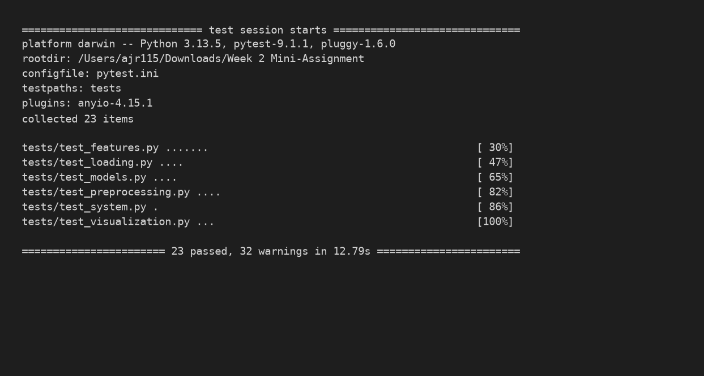
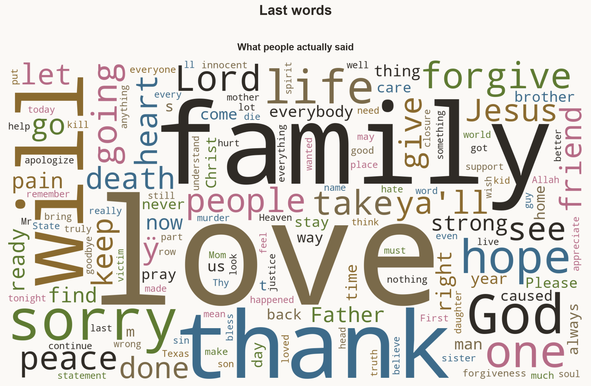
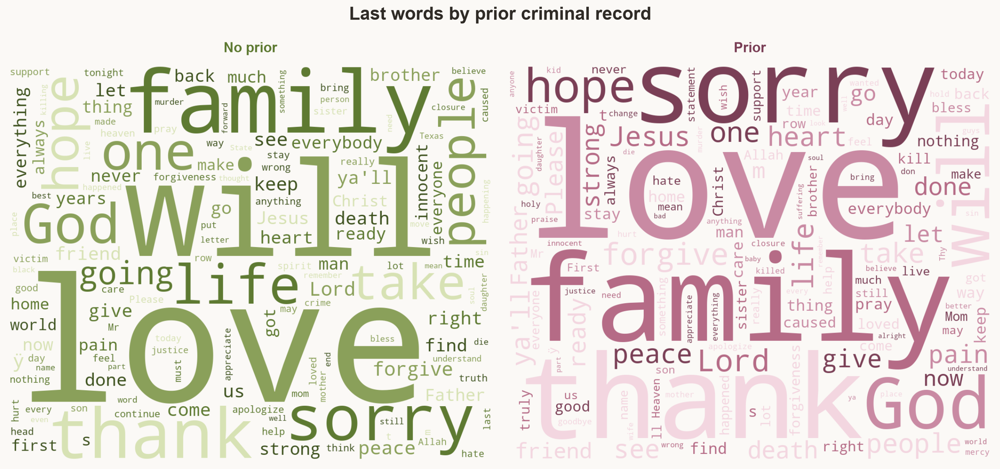
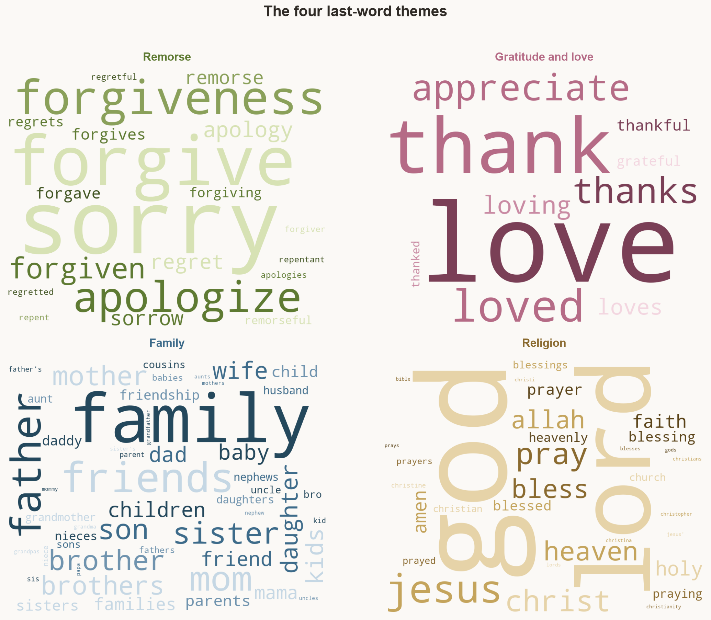
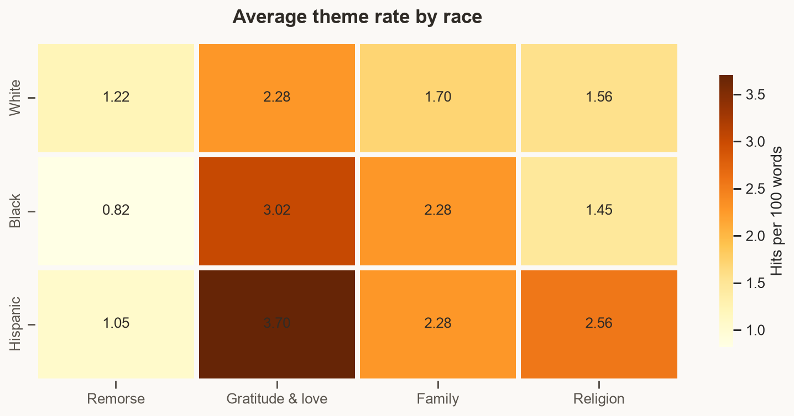
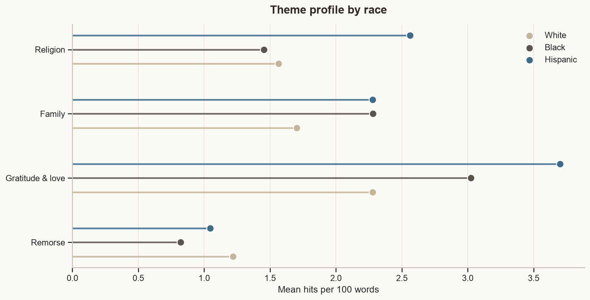

# Week 2 Mini-Assignment: Texas last statements

[](https://github.com/alissarivero/week-2-mini-assignment/actions/workflows/test.yml)

Alissa Rivero

This repository has four files:

1. A **Python data analysis script** — [`question1.py`](question1.py)
2. A **Python Jupyter notebook** (same analysis in [`question1.ipynb`](question1.ipynb))
3. This **README**
4. A **Rust Jupyter notebook** — [`question2.ipynb`](question2.ipynb)

The last section of the Python script (and notebook) also times **Pandas vs Polars** on the same pipeline.

The previous ASD microbiome analysis is in [`Old dataset/`](Old%20dataset/).

**Research questions**

1. Is a **prior criminal record** associated with more or less **apology / remorse** language?
2. Is a **prior criminal record** associated with more or less **religious** language?
3. What **themes** appear in last words (remorse, gratitude and love, family, religion), and are those rates predicted by **demographic categories**?

## Dataset

[Last Statements of Executed Offenders (Kaggle)](https://www.kaggle.com/datasets/ranjithkumarraik/last-words-of-death-row-inmates)

The file used here is `Texas Last Statement - CSV.csv`: last statements and demographics published by the Texas Department of Criminal Justice.

| | |
|---|---|
| Rows | 545 people |
| Columns | `Execution`, names, `Age`, `Race`, `CountyOfConviction`, `EducationLevel`, `PreviousCrime`, victim flags, `LastStatement` |
| Encoding | Latin-1 (not UTF-8); `NativeCounty` has a trailing space in the header |
| Groups | `PreviousCrime` 0 = 233 no prior record; 1 = 276 prior record; 36 NA rows dropped from the models |
| Missing statements | 114 declined / blank statements, scored as zero words |

Longer statements can mention more words of every kind, so theme comparisons use **hits per 100 words** (the same idea as relative abundance). Neutral verbs such as *ask* and *tell* are not treated as themes.

A second file, `Texas Last Statement - Excel.xlsx`, is the same table and is not used in the analysis.

## How to run the Python analysis

```bash
python -m pip install -r requirements.txt
python question1.py
```

Or open `question1.ipynb` and run all cells. The CSV files must stay in this same folder. If you see `ModuleNotFoundError`, the notebook kernel is a different Python than the one where you installed packages.

## Tests and CI

Importable functions live in [`analysis.py`](analysis.py) and [`visuals.py`](visuals.py). [`question1.py`](question1.py) is only the printed report; tests never import that script, so running pytest does not refit every model or rewrite the gallery.

[`pytest.ini`](pytest.ini) puts the project root on `pythonpath` and collects from `tests/`.

### How to run

```bash
python -m pip install -r requirements.txt
make test
```

Same thing without Make:

```bash
python -m pytest
python -m pytest -v
python -m pytest tests/test_loading.py -v
```

### What the suite covers

**23 tests:** 22 unit tests of core steps, plus 1 system/integration test of the full pipeline. Each file checks both the happy path and an edge case (missing file, blank statement, `NA` strings, words that should not count as themes).

| File | Workflow step | What it checks |
|---|---|---|
| [`tests/test_loading.py`](tests/test_loading.py) | Data loading | 545 rows; required columns; Latin-1 load; trailing space stripped from `NativeCounty`; missing path raises `FileNotFoundError` |
| [`tests/test_preprocessing.py`](tests/test_preprocessing.py) | Preprocessing | Declined / `None` / blank statements; real statements are kept; `"NA"` and junk become numeric missing; unknown `PreviousCrime` values are dropped |
| [`tests/test_features.py`](tests/test_features.py) | Feature engineering | Tokenizer; remorse / gratitude+love / family / religion hits per 100 words; *ask* and *tell* are not themes; `person` is not `son`; `goodbye` is not `god`; declined rows score 0 |
| [`tests/test_models.py`](tests/test_models.py) | Model train / predict / evaluate | `apology_rate ~ prior_crime` and `religion_rate ~ prior_crime` recover a known shift; p-values and `nobs`; demographic OLS includes Age, education, and race dummies; Other / missing rows are dropped |
| [`tests/test_visualization.py`](tests/test_visualization.py) | Visualization | Boxplots, word clouds, heatmap, and lollipop figures write real PNG files |
| [`tests/test_system.py`](tests/test_system.py) | Full pipeline | One integration test: load the real CSV → score themes → fit both model sets → write plots. Asserts 545 rows, 114 declined, 509 labeled, 479 demographic rows, fitted OLS objects, and non-empty figures |

The system test is the one that has to keep working if someone changes load, scoring, or plotting. The unit tests pin the pieces so a failure points at the step that broke.

### Continuous integration

[`.github/workflows/test.yml`](.github/workflows/test.yml) runs on every push, pull request, and manual dispatch:

1. Check out the repo
2. Set up Python 3.12
3. `make install` (`pip install -r requirements.txt`)
4. `make test` with `MPLBACKEND=Agg` so plots do not need a display

Status badge at the top of this file: [](https://github.com/alissarivero/week-2-mini-assignment/actions/workflows/test.yml)

### Passing run



## What the Python analysis does

1. Load and inspect `Texas Last Statement - CSV.csv`.
2. Split rows into no prior record (`PreviousCrime == 0`) and prior record (`PreviousCrime == 1`); flag declined statements.
3. Use `groupby()` for mean / count / std of word count, age, education, and theme rates by group and by race.
4. Compare race means side by side with percent difference (prior vs no prior).
5. Build four per-person theme scores (hits per 100 words):
   - **remorse / apology** — *sorry, apologize, forgive, remorse, regret*
   - **gratitude and love** (one theme) — *thank, grateful, love*
   - **family** (kept separate) — *mom, dad, kids, brother, sister, wife, family, friends*
   - **religion** — *god, jesus, christ, lord, heaven, pray, amen*
6. Fit the two original OLS models with prior crime as the predictor (`1` = prior record, `0` = none):
   - `apology_rate ~ prior_crime`
   - `religion_rate ~ prior_crime`
7. Fit four demographic OLS models (`theme ~ prior_crime + Age + EducationLevel + Race`, White as the reference):
   - `remorse_rate`, `gratitude_love_rate`, `family_rate`, `religion_rate`
8. Plot apology vs religion by prior record, and the four themes by race.
9. Time the same load + keyword-rate + group-mean pipeline in **Pandas** and **Polars**.

## Outcomes

- **Apology / remorse ~ prior crime:** no difference (about 1.07 vs 1.06 hits per 100 words). The prior-crime coefficient is −0.003 (p = 0.99, R² ≈ 0). The confidence interval crosses zero.
- **Religion ~ prior crime:** people with a prior record are about **0.50 words per 100 higher** (1.45 vs 1.95). That is only suggestive (p = 0.072, R² = 0.006) and the confidence interval crosses zero.
- **Themes:** last words are mostly **gratitude/love** and **family**, then religion and remorse. *Ask* and *tell* are not included.
- **Demographics (n = 479):** Hispanic speakers use more gratitude/love (+1.29 per 100, p = 0.009) and more religious language (+0.95, p = 0.025) than White speakers. Black speakers use less remorse language (−0.45, p = 0.022). Family language is common in every group and is not predicted by race, age, education, or prior crime. All four demographic models have small R² (0.014–0.029).
- **Takeaway:** a prior criminal record does not change remorse language and only weakly tracks religion. Race is the demographic that shows up, and even then it explains little of the theme rates. That is not a claim about guilt, faith, or who “should” apologize.
- **Polars:** the same load → keyword-rate → group-mean pipeline was about **11× faster** in Polars than in Pandas on this table (~10 ms vs ~114 ms). Polars uses a word-boundary regex over the same lists, so group means can differ slightly from the Python tokenizer.

## Visualizations

`python question1.py` writes the original boxplots plus a gallery of word clouds and theme summaries. Neutral verbs such as *ask* and *tell* are left out of the clouds.

**What people actually said**



**By prior record**



**The four themes** (only remorse, gratitude/love, family, and religion words)



**Theme rates by race**





## Question 2: Rust notebook

[`question2.ipynb`](question2.ipynb) is the **same analysis as the Python notebook**, rewritten in Rust, with the same section titles, dataset abstract, and interpretation write-up. It loads `Texas Last Statement - CSV.csv`, inspects it, splits prior vs no prior, groups by race, builds theme scores, fits the same OLS models, and draws the boxplots. Ownership is used so it **works**: clone when two names need the list, borrow (`&`) to look without taking, and drop readers before a write.

1. Install the Rust Jupyter kernel (`evcxr_jupyter --install`) if it is not already there.
2. Open `question2.ipynb` and pick **Rust** (not Python). If `let` is a `SyntaxError`, you are still on Python.
3. Run all cells from top to bottom. Every cell is meant to compile.

## Files

| File | Role |
|---|---|
| `question1.py` | Data analysis Python script (required) |
| `analysis.py` | Importable load / score / model / plot functions |
| `question1.ipynb` | Same analysis as a notebook, plus the Polars timing |
| `question2.ipynb` | Same analysis in Rust, plus ownership experiments (required) |
| `tests/` | Unit tests plus one system test |
| `.github/workflows/test.yml` | GitHub Actions CI |
| `requirements.txt` / `Makefile` | Install and `make test` |
| `README.md` | This file (required) |
| `docs/tests-pass.png` | Screenshot of the passing test run |
| `Texas Last Statement - CSV.csv` | Last-statement table used in the analysis |
| `Texas Last Statement - Excel.xlsx` | Same table (not used) |
| `apology_religion.png` | Prior-crime figure written by `question1.py` |
| `last_statement_themes.png` | Theme-by-race figure written by `question1.py` |
| `wordcloud_all.png` | Word cloud of every spoken last statement |
| `wordclouds_prior.png` | Word clouds, no prior vs prior record |
| `wordclouds_themes.png` | Four theme word clouds |
| `theme_heatmap.png` / `theme_profile.png` | Theme rates by race |
| `visuals.py` | Word-cloud and gallery figures |
| `Old dataset/` | Previous ASD microbiome assignment files |
