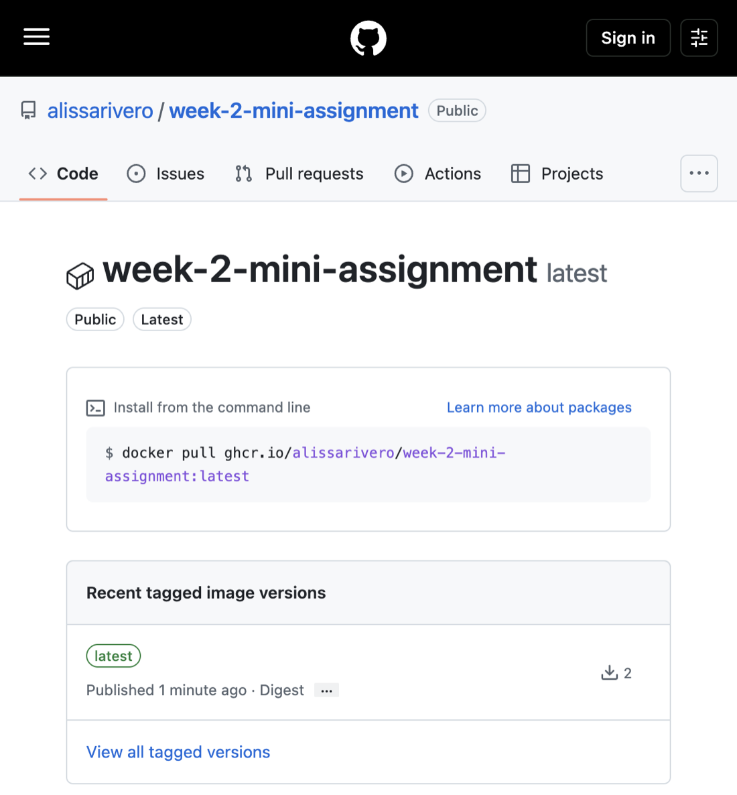

# Week 2 Mini-Assignment: Texas last statements

[](https://github.com/alissarivero/week-2-mini-assignment/actions/workflows/test.yml)

Alissa Rivero

## Refactoring Slogan
If it ain't broke, refactor it anyway

## Setup

```bash
python -m pip install -r requirements.txt
python question1.py
make test
```

## Problem

Texas publishes the last statements of people it executes, along with age, race, education, and whether the person had a prior criminal record. Three questions:

1. Is a **prior criminal record** associated with more or less **apology / remorse** language?
2. Is a **prior criminal record** associated with more or less **religious** language?
3. What **themes** appear in last words (remorse, gratitude and love, family, religion), and do **age, education, race, or a prior record** predict those rates?

## Data

[Last Statements of Executed Offenders (Kaggle)](https://www.kaggle.com/datasets/ranjithkumarraik/last-words-of-death-row-inmates). The file used here is `Texas Last Statement - CSV.csv` (545 people, Latin-1). Theme comparisons use **hits per 100 words**, so a longer statement is not credited with more of every theme just because it is longer. *Ask* and *tell* are not themes.

| What is wrong | What the analysis does |
|---|---|
| `PreviousCrime` is NA (36 rows) | Dropped from the groups and from every model |
| Declined or blank statement (114 rows) | Scored as 0 words and 0 on every theme, and kept in the primary models |
| `EducationLevel` is not numeric, or race is `Other` | Dropped only from the demographic models. Age has no missing values |
| Spoken statement shorter than 20 words (54 rows) | Kept in the primary models. One keyword in a short line can be 50–100 hits per 100 words. Boxplot fliers are off; the points are still drawn |
| Very long statements | The longest spoken statement is 1,267 words. Rates are per 100 words, so length alone does not add hits |

The primary models keep every labeled row. A second fit drops declined rows and statements under 20 words, to see whether the answers depend on those zeros and short lines.

## Methods

`python question1.py` loads the CSV, scores four themes, and fits OLS. [`analysis.py`](analysis.py) holds the functions the tests import. [`question1.ipynb`](question1.ipynb) is the same analysis; [`question2.ipynb`](question2.ipynb) is that analysis in Rust.

1. Label no prior record (`PreviousCrime == 0`) and prior record (`PreviousCrime == 1`).
2. Score remorse, gratitude/love, family, and religion as hits per 100 words.
3. Fit `apology_rate ~ prior_crime` and `religion_rate ~ prior_crime`, then refit both on spoken statements of at least 20 words.
4. Fit each theme on prior crime, age, education, and race (White as the reference).
5. Plot the rates and time the same pipeline in Pandas and Polars.

## Results

- **Apology ~ prior crime:** no difference (about 1.07 vs 1.06 hits per 100 words; coefficient −0.003, p = 0.99).
- **Religion ~ prior crime:** about **0.50 hits per 100 words higher** with a prior record (1.45 vs 1.95). That is only suggestive (p = 0.072) and the confidence interval crosses zero.
- **Longer statements only (n = 359):** apology stays flat (p = 0.39). The religion gap shrinks to 0.39 hits per 100 words and the p-value moves to 0.20. The weak religion result was leaning on the zeros and the short statements.
- **Demographics (n = 479):** Hispanic speakers use more gratitude/love (+1.29, p = 0.009) and more religious language (+0.95, p = 0.025) than White speakers. Black speakers use less remorse language (−0.45, p = 0.022). Family language is common in every group. All four models have small R² (0.014–0.029).
- **Takeaway:** a prior record does not change remorse language, and the religion difference does not hold once declined and very short statements are set aside. Race shows up, and still explains little. That is not a claim about guilt, faith, or who should apologize.
- **Polars** ran the same load, keyword-rate, and group-mean steps about **11× faster** than Pandas on this table (~10 ms vs ~114 ms).

## Figures


## Tests and CI

**26 tests** in [`tests/`](tests/): typical cases and edge cases (missing file, blank statement, `"NA"` strings, words that should not count as themes, a one-word statement that scores 100). [`.github/workflows/test.yml`](.github/workflows/test.yml) runs on every push, pull request, manual dispatch, and every Monday at 12:00 UTC. One job lints with Black and flake8. The test job uses a matrix of Python 3.12 and 3.13. `make lint` and `make format` are the local versions.


## Docker

The image runs the test suite from `python:3.12-slim`. Each Dockerfile instruction is a layer. The CSV has to be copied into the image, or the tests cannot find the file. These commands were run with Docker Desktop (`desktop-linux`).

```bash
docker build -t last-statements .
docker run --rm last-statements
```

`docker run --rm` runs pytest and deletes the container. The screenshot names the container so `docker ps -a` still shows **Exited (0)**.

The same image is on GitHub Container Registry. [`.github/workflows/docker.yml`](.github/workflows/docker.yml) builds and pushes it on every push to `main`.

```bash
docker pull ghcr.io/alissarivero/week-2-mini-assignment:latest
docker run --rm ghcr.io/alissarivero/week-2-mini-assignment:latest
```




## Refactoring

`add_text_scores` used to divide hits by word count four times. Those copies now go through `hits_per_hundred`, and the word lists sit in one `THEMES` registry. `plot_prior_crime` and `plot_themes` shared one boxplot-and-strip routine, `_draw_grouped_boxes`. A scoring or styling fix happens in one place. The public names such as `REMORSE_EXACT` are unchanged, so the old tests still import them.

Checked with pytest (26 passed) and with Black and flake8. Commit [`79b0a94`](https://github.com/alissarivero/week-2-mini-assignment/commit/79b0a94):


The earlier ASD microbiome files are in [`Old dataset/`](Old%20dataset/).
